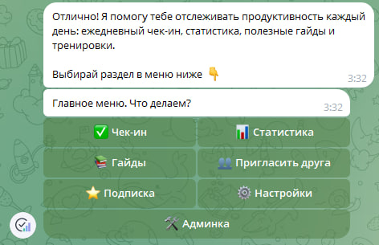
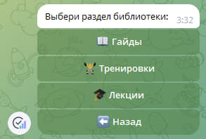
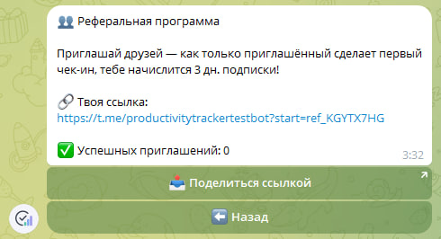
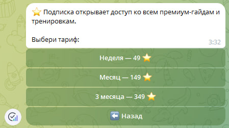
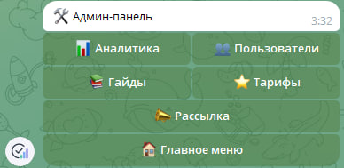

# Productivity Tracker Bot


**Language:** [🇷🇺 Русский](README.md) · 🇬🇧 English

A Telegram bot with a fully inline-button UI for daily productivity tracking:
check-ins, stats, a PDF content library, a referral program, paid subscriptions via
**Telegram Stars**, and a complete admin panel that lives entirely inside Telegram —
no external web page required.

The project is built as a ready-to-adapt template: the check-in mechanic, content,
pricing plans and branding can all be tailored to any niche — fitness coaching,
online courses, mentorship programs, subscription communities, and more.

> ⚠️ What's shown below is a demo deployment for presentation purposes: a test bot
> and test admin panel with sample data. In a real engagement the bot is deployed on
> the client's own server (Docker/VPS) with their branding, content and pricing.

## What it looks like

Users don't install anything — the whole experience happens through inline buttons
right inside the chat with the bot.



## Features

### ✅ Daily check-in

Rate the day from 1 to 10, add a short note, automatic streak and 7/30-day average
calculation. The mechanic can easily be swapped for any core business metric —
workouts, study progress, habits, and so on.

### 📊 Stats

Current and best streak, average scores, paginated check-in history — users see
their progress without ever leaving Telegram.

### 📚 Content library

Guides, workouts and lectures as PDFs, organized by category; part of the content
can be gated behind a subscription — a ready-made paywall mechanism.



### 👥 Referral program

A personal link for every user, bonus subscription days for inviting a friend —
built-in viral growth with zero extra setup.



### ⭐ Monetization via Telegram Stars

Multiple pricing plans, a ready-made payment flow (`send_invoice` →
`pre_checkout_query` → `successful_payment`) — no third-party payment provider or
processing fees. Plans are edited straight from the admin panel, no code changes needed.



### 🛠 Admin panel inside the bot

Analytics (DAU/WAU/MAU, revenue, conversion, top content), user management (grant
premium, ban), full CRUD for content and pricing plans, mass broadcast — all without
a separate web panel that would need to be hosted and secured on its own.



### 🌐 Multi-language

Switchable RU/EN interface for end users; adding another language is straightforward.

### ⏰ Reminders

Automatic daily push to anyone who hasn't checked in yet (APScheduler).

## Stack

Python 3.11+, aiogram 3, SQLAlchemy 2.0 (async) + SQLite (migrates painlessly to
Postgres/MySQL as load grows), APScheduler, pydantic-settings. The bot runs on long
polling, so it needs no domain or SSL certificate — it deploys with a single command
on any server or container.

## Quick start (local)

```bash
python -m venv .venv
.venv\Scripts\activate      # Windows
pip install -r requirements.txt
copy .env.example .env
```

Fill in `.env`:

1. `BOT_TOKEN` — get one from [@BotFather](https://t.me/BotFather) via `/newbot`.
2. `ADMIN_IDS` — your numeric Telegram ID (find it via [@userinfobot](https://t.me/userinfobot)).
   Multiple admins can be comma-separated.
3. `TIMEZONE` — timezone used for daily reminders (defaults to `Europe/Moscow`).

Run it:

```bash
python -m bot.main
```

On first run the bot creates its database and seeds demo content (one item per
category) plus 3 subscription plans, so the library and subscription screens aren't
empty even without manual setup.

## Running with Docker

```bash
copy .env.example .env
docker compose up -d --build
```

Ready to deploy to any VPS/cloud — see [DEPLOYMENT.md](DEPLOYMENT.md) for details.

## Becoming an admin

Add your Telegram ID to `ADMIN_IDS` in `.env` and restart the bot. A "🛠 Admin panel"
button then appears in the main menu (also available via the `/admin` command). From
there you can: view analytics, grant/revoke premium, ban users, manage content and
pricing plans, and send broadcasts — no developer involvement needed.

## Tests

```bash
pip install -r requirements-dev.txt
pytest
```

Tests cover the core logic: streak calculation, referral rewards, ru/en translation
consistency, and subscription-extension math.

## Project structure

```
bot/
  main.py            # entry point
  config.py           # settings loaded from .env
  database/            # SQLAlchemy models + repositories
  handlers/              # user-facing and admin-panel handlers
  keyboards/               # inline keyboards
  middlewares/               # DB session, user context, activity tracking
  services/                    # streaks, i18n, referrals, Stars, scheduler
  locales/                       # ru.json / en.json
sample_guides/           # demo PDF content
scripts/                  # demo PDF generator, DB seeder
screenshots/               # screenshots used in this README
tests/                      # unit tests (pytest)
```

## Possible extensions for a specific project

- Custom branding, copy and content for the client's niche.
- A different core metric instead of "productivity" (weight, workouts, study
  progress, etc.).
- Per-user timezones.
- A web version of the admin panel, if access outside Telegram is needed.
- Refunds for Stars payments, promo codes, a trial period.
- Alembic migrations and a move to Postgres as the project scales.
